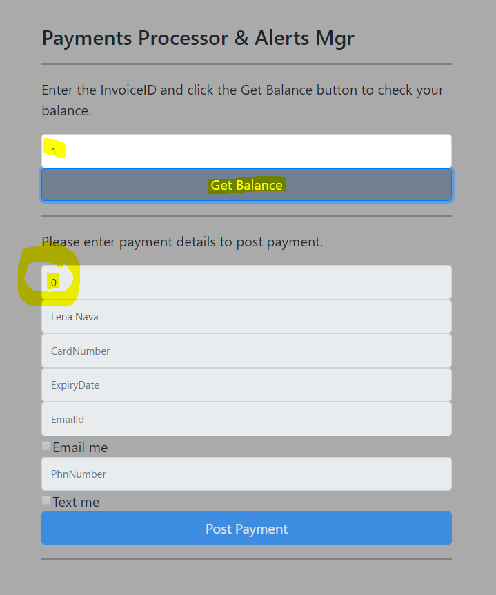

# Payment processor with work flow state machine using Data using AWS S3, Lambda Functions, Step Functions and DynamoDB.
### This article shows how to use these AWS services - S3, Lambda Functions, Step Functions, API Gateway and DynamaDB to process a payment.
### Objective:
- For the Billling and Payment process, a file is placed/updated in S3 everyday for customers whose Bill is due/pending and
- Next, this Bills Due file is processed by a Lambda Function to update the information in a DynamoDB table and
- Next, on the Billings Website, a customer retrives his bill by entering his Invoice ID and makes a payment and
- Next, the payment is processed and Balance is updated to zero and 
- Finally, a text or email alert is sent to customer confirming his payment

### Lets tabulate the steps as below:
Steps | Actions
------------ | -------------
Prerequisite | Generate the 'Bills Due' file for specific day 
S3 | Create a S3 bucket and upload the 'Bills Due' file
DynamoDB | Create a table to store 'Bills Due'
Lambda Functions | Create functions to update DynamoDB database with 'Bills Due' info, email and text alert, process payment etc
Step Function | Create a Step function to create a work flow which will process the payment and send email/text alert 
API Gateway | create a managed API Gateway service to expose endpoints to getBalance and processPaymentFlow Lambda functions

#### Prerequisite - Generate the 'Bills Due' file for specific day  
 - I am using an arbitrary logic to generate the file.
 - Once generated, the file will look like below
   
 - Here is the code for the file(PaymentBalanceGenerator.py):
  ```
    # Prerequisites: Please install the following before genarating the file.
    # install pip and dependencies
    # sudo apt-get install python-pip python-dev build-essential
    # install names 
    # pip install names
    import names
    import random
    import os

    dirName = 'logs';
    if not os.path.exists(dirName):
        os.mkdir(dirName)

    filePath = dirName + '/paymentbalance.csv';
    with open(filePath, 'w+') as outfile:
        numRows = range(1,1001)
        outfile.write('InvoiceID,CustomerName,Balance,IsProcessed\n')
        strRow = ''
        for numRow in numRows:
            strRow = str(numRow) + ',' + names.get_full_name(gender='female') + ',' + str(random.randint(500, 900)) + ',0'
            outfile.write(strRow + '\n')
        outfile.close()

    print('Please check the file at path:' + os.path.abspath(filePath));            
       
  ```
- Now save and execute the above python file(PaymentBalanceGenerator.py will generate a csv file 'paymentbalance.csv' in logs folder):
  ```
  python PaymentBalanceGenerator.py
  ```
  
#### S3	- Create a S3 bucket and upload the 'Bills Due' file
- Create a bucket name - any universally unique name is okay. 
  - Lets create a bucket named - nm-payment-balance**
  - Please see the snapshot below
  
  
#### Lambda | Create a Lambda function with a trigger which gets invokes as a file is uplaoded to S3 
- Create the follwing Lambda Functions  - . 
  - 1. PaymentBalanceRetriever.py - 
        - This lambda function will have a trigger associated on bucket nm-payment-balance
        - Once the file 'paymentbalance.csv' is uploaded to the vucket, this lambda function will read the file and update the info in a DunamoDB table 'PaymentBalance'
  - Here is the code as below:
    ```
    import boto3
    import csv 
    import json

    s3 = boto3.client('s3')
    dynamodb = boto3.client('dynamodb')

    def handler(event, context):
        # Get the object from the event then download it to Lambda tmp space
        bucket = event['Records'][0]['s3']['bucket']['name']
        key = event['Records'][0]['s3']['object']['key']
        if '.csv' not in key:
            return 'Not a csv that needs processing'
        s3.download_file(bucket, key, '/tmp/' + key)
        # Use DynamoDB atomic counters to tally visits in csv
        with open('/tmp/' + key, 'r') as infile:
            first_line = infile.readline()
            for row in infile:
                ddb_InvoiceId = row.strip().split(',')[0]
                ddb_CustomerName = row.strip().split(',')[1]
                ddb_Balance = row.strip().split(',')[2]
                ddb_Processed = row.strip().split(',')[3]
                response = dynamodb.update_item(
                        TableName='PaymentBalance', 
                        Key={
                            'InvoiceID': {'N': ddb_InvoiceId}
                        },
                        UpdateExpression='set Balance=:balance, IsProcessed=:processed, CustomerName=:customerName',
                        ExpressionAttributeValues={
                            ':balance': {'N': ddb_Balance},
                            ':processed': {'N': ddb_Processed},
                            ':customerName': {'S': str(ddb_CustomerName)}
                        },
                        ReturnValues="UPDATED_NEW"
                )
                print(response)
    ```

  - 2. getBalance.js - 
        - This lambda function reads a record from DynamoDB table 'PaymentBalance' and returns the document/row.
        - This function is called from the web form to return the bill due details based on a specific Invoice Id entered by user on the form

      - Here is the code as below:
        ```
        'use strict';

        var AWS = require("aws-sdk");
        AWS.config.update({region: "us-east-1"});
        var db = new AWS.DynamoDB.DocumentClient();

        module.exports.get = (event, context, callback) => {

            const data = event.queryStringParameters;
            const params = {
                TableName: "PaymentBalance",
                Key: {
                  InvoiceID: parseInt(data.InvoiceID)
                }
            };

            db.get(params, (err, result) => {
                if (err) {
                    console.error(err);
                    const errorResponse = {
                        statusCode: err.statusCode || 501,
                        headers: { 'Content-Type': 'text/plain'},
                        body: JSON.stringify('Sorry, Cound not get the item for:' + data.InvoiceID),
                    };
                    callback(null, errorResponse);
                    return;
                };

                const successResponse = {
                    statusCode: 200,
                    body: "Retrieved Item successfully. " + JSON.stringify(result),
                };
                callback(null, successResponse);
            });
        };

    ```
    
 - 3. postPayment.py - 
        - This lambda function takes the inputs from the user and posts the payment and updates the 'PaymentBalance' table.
        - Although in a real environment a third party payment service will be called and based on the results from that service the 'PaymentBalance' table will be updated
        - Here we are assuming the payment is processed by third party and we have to only uodated the table by setting = balance = 0 and isprocessed = 1
      - Here is the code as below:
        ```
        import boto3
        import csv 
        import json

        s3 = boto3.client('s3')
        dynamodb = boto3.client('dynamodb')

        def lambda_handler(event, context):
            # assuming the payment was process by a third party after passing payment info securily and encrypted.
            # another lambda function can handle the real payment processing via a third party
            invoiceId = event['InvoiceID']
            billerName = event['BillersName']
            # manually seeting balance as 0 and isprocessed as 1 simulate as if a payment was done.
            balance = 0
            isprocessed = 1
            response = dynamodb.update_item(
                TableName='PaymentBalance', 
                Key={
                    'InvoiceID': {'N': invoiceId}
                },
                UpdateExpression='set Balance=:balance, IsProcessed=:processed, CustomerName=:customerName',
                ExpressionAttributeValues={
                    ':balance': {'N': str(balance)},
                    ':processed': {'N': str(isprocessed)},
                    ':customerName': {'S': str(billerName)}
                },
                ReturnValues="UPDATED_NEW"
            )
            print(response)
            return event;
     ```

 - 4. processEmails.py - 
        - This lambda function will be used to send to process emails after the payment is posted.
        - 'event' object returns the BilliAmount, BillerName, InvoiceID etc 
        - The function used SES function 'send_email' to send emails
        - ***IMPORTANT*** 
            - Since the Non Prod SES is a Sanbox environment, onlt a verified email id can be used for source and destination for the emails
            - But on Prod environments no such email verification is needed
            - To verify an email go the the SES Dashboard and verify an email, a verification email will be sent and once you click on the verification link then the email gets verified.
            - See snapshot below.
              
         
      - Here is the code as below:
        ```
        import boto3

        VERIFIED_EMAIL = 'tpml9090@gmail.com'

        ses = boto3.client('ses')

        def lambda_handler(event, context):

            email_subject = 'A payment of amount:' + event['BillingAmount'] + ' has been processed for Invoice Id:' + event['InvoiceID'] + '.'
            email_body = ' Mr./Ms. ' + event['BillersName'] + '\n Thank you, \n A payment of amount:' + event['BillingAmount'] + ' has been processed for Invoice Id:' + event['InvoiceID'] + '.'

            ses.send_email(
                Source=VERIFIED_EMAIL,
                Destination={
                    'ToAddresses': [event['EmailId']]
                },
                Message={
                    'Subject': {'Data': email_subject},
                    'Body': {'Text' : {'Data': email_body }}
                }
            )
            return 'Success!'
        ```

 - 5. processTexts.py - 
        - This lambda function will be used to send to process texts after the payment is posted.
        - 'event' object returns the BilliAmount, BillerName, InvoiceID etc 
        - The function uses SNS function 'publish' to send emails
      - Here is the code as below:
        ```
        import boto3

        sns = boto3.client('sns')

        def lambda_handler(event, context):
            sns_msg = 'A payment of amount:' + event['BillingAmount'] + ' has been processed for Invoice Id:' + event['InvoiceID'] + '.'
            sns.publish(PhoneNumber=event['PhnNumber'], Message=sns_msg)
            return 'Success!'
        ```

 - 5. processPaymentMachine.py - 
        - This lambda function will used to validate the input from the web form.
            - If the data posted is invalid then this function returns an error back to the form as response
            - If thee data is valid then it calles the STATE Machine/Step function
        - You must enter a valid Step Function ARN for this Lambda function to work 
        - The function uses actually calls the Step function to call a series of other functions as workflow
        - The 'start_execution' function posts the input data to the function to process it.
      - Here is the code as below:
        ```
        import boto3
        import os
        import json
        import decimal

        # PLease replace with an actual Step function ARN as this ARN is a test URL
        ARN_OF_STATEMACHINE = 'arn:aws:states:us-east-1:1234567890:stateMachine:processPaymentMachine'

        sfn = boto3.client('stepfunctions')

        def lambda_handler(event, context):
            print('Processing the event:')
            print(event)
            data = json.loads(event['body'])
            data['WaitSeconds'] = int(data['WaitSeconds'])

            # Validation Check
            validationCheck = []
            validationCheck.append('WaitSeconds' in data)
            validationCheck.append(type(data['WaitSeconds']) == int)
            validationCheck.append('InvoiceID' in data)
            validationCheck.append('BillersName' in data)
            validationCheck.append('BillingAmount' in data)
            validationCheck.append('CardNumber' in data)
            validationCheck.append('ExpiryDate' in data)

            if data.get('Choices') == "both":
                validationCheck.append('EmailId' in data)
                validationCheck.append('PhnNumber' in data)
            elif data.get('Choices') == "email":
                validationCheck.append('EmailId' in data)
            elif data.get('Choices') == "text":
                validationCheck.append('PhnNumber' in data)

            # Check for any errors in validation validationCheck
            if False in validationCheck:
                response = {
                    "statusCode": 400,
                    "headers": {"Access-Control-Allow-Origin":"*"},
                    "body": json.dumps(
                        {
                            "Status": "Success", 
                            "Reason": "Sorry, please verify the data you posted and try again!!!"
                        },
                        cls=DecimalEncoder
                    )
                }
            else: 
                sfn.start_execution(
                    stateMachineArn=ARN_OF_STATEMACHINE,
                    input=json.dumps(data, cls=DecimalEncoder)
                )
                response = {
                    "statusCode": 200,
                    "headers": {"Access-Control-Allow-Origin":"*"},
                    "body": json.dumps(
                        {"Status": "Success"},
                        cls=DecimalEncoder
                    )
                }
            return response

        # This is a workaround for: http://bugs.python.org/issue16535
        class DecimalEncoder(json.JSONEncoder):
            def default(self, obj):
                if isinstance(obj, decimal.Decimal):
                    return int(obj)
                return super(DecimalEncoder, self).default(obj)


        ```

#### Step Function | Create a Step function to create a work flow which will process the payment and send email/text alert ####
- This step is the most important step in the this project
- We will create a workflow using the workflow json which will govern how this steps fucntion/state engoine will move from one state to the to process and call other lambda functions.
- You can visually see how the state flow looks like and if it succed it shows you the passed workflow else the fialed workflow.
- The work flow starts with 
  - 'Wait' state for 1 sec
  - Then it moves to 'ProcessPayment' state to process the payment
  - Then it moves to 'ChoiceAlertState' task to choice if we the user only wants email or text or both kind of alerts
  - In case of both email and text it enters in a 'Parallel' type state
  - Then it moves to 'Finalstate' state to process the payment and reach the end of the work flow
  - In case of any error it moves to state 'DefaultState' which is basically error state
- Here is the workflow code for the step function:
  ```
      {
      "Comment": "This state machine processes a payment and sends text/email alerts.",
      "StartAt": "Wait",
      "States": {
        "Wait": {
          "Type": "Wait",
          "SecondsPath": "$.WaitSeconds",
          "Next": "ProcessPayment"
        },

        "ProcessPayment": {
          "Type" : "Task",
          "Resource": "ARN_OF_POSTPAYMENTS",
          "Next": "ChoiceAlertState"
        },

        "ChoiceAlertState": {
          "Type" : "Choice",
          "Choices": [
            {
              "Variable": "$.Choices",
              "StringEquals": "email",
              "Next": "ProcessEmails"
            },
            {
              "Variable": "$.Choices",
              "StringEquals": "text",
              "Next": "ProcessTexts"
            },
            {
              "Variable": "$.Choices",
              "StringEquals": "both",
              "Next": "ProcessEmailsandTextsBoth"
            }
          ],
          "Default": "DefaultState"
        },

        "ProcessEmails": {
          "Type" : "Task",
          "Resource": "ARN_OF_PROCESSEMAILS_FUNCTION",
          "Next": "FinalState"
        },

        "ProcessTexts": {
          "Type" : "Task",
          "Resource": "ARN_OF_PROCESSTEXTS_FUNCTION",
          "Next": "FinalState"
        },

        "ProcessEmailsandTextsBoth": {
          "Type": "Parallel",
          "Branches": [
            {
              "StartAt": "ProcessEmailsParallel",
              "States": {
                "ProcessEmailsParallel": {
                  "Type" : "Task",
                  "Resource": "ARN_OF_PROCESSEMAILS_FUNCTION",
                  "End": true
                }
              }
            },
            {
              "StartAt": "ProcessTextsParallel",
              "States": {
                "ProcessTextsParallel": {
                  "Type" : "Task",
                  "Resource": "ARN_OF_PROCESSTEXTS_FUNCTION",
                  "End": true
                }
              }
            }
          ],
          "Next": "FinalState"
        },

        "DefaultState": {
          "Type": "Fail",
          "Error": "DefaultStateError",
          "Cause": "Error!"
        },

        "FinalState": {
          "Type": "Pass",
          "End": true
        }
      }
    }
  ```
- Please see the snalshot of the State engione work flow.
  
  
  

#### API Gateway | create a managed API Gateway service to expose endpoints to getBalance and processPaymentFlow Lambda functions
- The  will have a child resource ID which will execute the 'getBalance' Lambda functions and takes INvoiceID as queryString.
- Steps to create a API Gateway
  - Create a API name - PaymentProcessor
  - Create a Resource - paymentbalance
  - Create a method - POST - this method will call the postPayment Lambda Function
  - Create a child resource ID and then a GET method - this method will call the getBalance Lambda Function
  - Enable CORS for cross origin resource sharing
  - Deploy the API to a stage - e.g Prod
- Please see the snapshot below.
  
  

#### DynamoDB | Once the file is getting processed keep writing and updating the data in a table
- Create a DynamoDB table 'PaymentBalance' with Primary Key as 'InvoiceID' .
- Please see the snapshot below.
  

#### the S3 website and how the customer submits a payment
- Please upload the contents of the website folder to a S# bucket and configure it as a website.
- The user first enters the 'InvoiceID' to retrive the bill details
- Once the bill details( InvoiceID, BillersName, Amount Due) are retrived the user eneters the ceredit card into ans submits the data
  - A form with valid Bill due amount
    
  - A form with 0 Bill due amount
    
  - Code snippet for the HTML page
    ```
    <!DOCTYPE html>
    <html lang="en">
      <head>
        <meta charset="utf-8">
        <meta name="viewport" content="width=device-width, initial-scale=1, shrink-to-fit=no">
        <title>Payments Processor & Alerts Mgr</title>
        <!-- CSS Files References -->
        <link rel="stylesheet" href="https://cdnjs.cloudflare.com/ajax/libs/twitter-bootstrap/4.2.1/css/bootstrap.min.css">
        <link href="main.css" rel="stylesheet">
      </head>
      <body>
        <div class="container">
          <form class="form-payments">
            <h2 class="form-payments-heading">Payments Processor & Alerts Mgr</h2>
            <hr>
            <p>Enter the InvoiceID and click the Get Balance button to check your balance.</p>
            <label for="InvoiceID" class="sr-only">InvoiceID</label>
            <input type="email" id="InvoiceID" class="form-control" placeholder="InvoiceID">
            <button id="getBalanceButton" class="btn btn-md btn-primary btn-block" type="submit">Get Balance</button>
            <hr>
            <p>Please enter payment details to post payment.</p>
            <label for="BillingAmount" class="sr-only">Billing Amount</label>
            <input type="input" id="BillingAmount" class="form-control" placeholder="BillingAmount">
            <label for="BillersName" class="sr-only">Billers Name</label>
            <input type="input" id="BillersName" class="form-control" placeholder="BillersName">
            <label for="CardNumber" class="sr-only">Card Number</label>
            <input type="input" id="CardNumber" class="form-control" placeholder="CardNumber">
            <label for="ExpiryDate" class="sr-only">Expiry Date</label>
            <input type="input" id="ExpiryDate" class="form-control" placeholder="ExpiryDate">
            <label for="EmailId" class="sr-only">Email Id</label>
            <input type="input" id="EmailId" class="form-control" placeholder="EmailId">
            <input type="checkbox" id="EmailChoice" value="email">Email me<br>
            <label for="PhnNumber" class="sr-only">Phone Number</label>
            <input type="input" id="PhnNumber" class="form-control" placeholder="PhnNumber">
            <input type="checkbox" id="TextChoice" value="text">Text me<br>
            <button id="postPaymentButton" class="btn btn-md btn-primary btn-block" type="submit">Post Payment</button>
            <hr>
            <br>
            <div id='error-msg'></div>
            <div id='success-msg'></div>
            <div id='results-msg'></div>
          </form>
         </div>
        <!-- JS Files References -->
        <script src="main.js"></script>
        <script src="https://code.jquery.com/jquery-3.1.1.slim.min.js"></script>
        <script src="https://cdnjs.cloudflare.com/ajax/libs/tether/1.4.0/js/tether.min.js"></script>
        <script src="https://cdnjs.cloudflare.com/ajax/libs/twitter-bootstrap/4.2.1/js/bootstrap.min.js"></script>
        <script src="https://cdnjs.cloudflare.com/ajax/libs/jquery/3.3.1/jquery.min.js"></script>
        <script src="https://cdnjs.cloudflare.com/ajax/libs/fetch/2.0.1/fetch.js"></script>
      </body>
    </html>

    ```
  - Code snippet for the JS file
    ```
    // Please enter the actual APIGATEWAYURL from the API Gateway Screen
    var APIGATEWAYURL = 'https://p0gtmoln90.execute-api.us-east-1.amazonaws.com/prod';

    // setup divs for error, success and results
    var divError = document.getElementById('error-msg')
    var successDiv = document.getElementById('success-msg')
    var resultsDiv = document.getElementById('results-msg')

    var invoiceID = document.getElementById('InvoiceID')
    var billingAmount = document.getElementById('BillingAmount')
    var billersName = document.getElementById('BillersName')
    var cardNumber = document.getElementById('CardNumber')
    var expiryDate = document.getElementById('ExpiryDate')
    var emailId = document.getElementById('EmailId')
    var phnNumber = document.getElementById('PhnNumber')
    var emailChoice = document.getElementById('EmailChoice')
    var textChoice = document.getElementById('TextChoice')

    var postPaymentButton = document.getElementById('postPaymentButton')

    // setup functions to get the field data
    function getInvoiceID() { return invoiceID.value }
    function getBillingAmount() { return billingAmount.value }
    function getBillersName() { return billersName.value }
    function getCardNumber() { return cardNumber.value }
    function getExpiryDate() { return expiryDate.value }
    function getEmailId() { return emailId.value }
    function getPhnNumber() { return phnNumber.value }
    function getEmailChoice() { return emailChoice.value }
    function getTextChoice() { return textChoice.value }

    function clearMessageDivs(state) {
        // clear the error, sucess and results div to refresh the content
        divError.textContent = '';
        resultsDiv.textContent = '';
        successDiv.textContent = '';

        invoiceID.disabled = false;
        billersName.disabled = true;
        billingAmount.disabled = true;

        if(state == 'get'){
            cardNumber.disabled = false;
            expiryDate.disabled = false;
            emailId.disabled = false;
            phnNumber.disabled = false;
            emailChoice.disabled = false;
            textChoice.disabled = false;
            postPaymentButton.disabled = false;
        }
        else{
            cardNumber.disabled = true;
            expiryDate.disabled = true;
            emailId.disabled = true;
            phnNumber.disabled = true;
            emailChoice.disabled = true;;
            textChoice.disabled = true;;
            postPaymentButton.disabled = true;
        }

    }

    clearMessageDivs('load');

    // Add the click listeners for both buttons button that make the API request

    document.getElementById('getBalanceButton').addEventListener('click', function (event) {
        // prevent page reloading by  clear message Divs
        event.preventDefault()
        clearMessageDivs('get')
        // Call the GET API service by Passing the InvoiceID
        fetch(APIGATEWAYURL+ '/paymentbalance/id?InvoiceID='+getInvoiceID(), {
            headers:{
                "Content-type": "application/json"
            },
            method: 'GET',
            mode: 'cors'
        })
        .then((resp) => resp.json()) 
        .then(function(data) {
            console.log(data)
            if(data.Item.Balance<=0){
                clearMessageDivs('postnobalancedue')   
            }
            successDiv.textContent = 'Please check your balance and make proper payment.';
            resultsDiv.textContent = JSON.stringify(data);
            invoiceID.value = data.Item.InvoiceID;
            billersName.value = data.Item.CustomerName;
            billingAmount.value = data.Item.Balance;
        })
        .catch(function(err) {
            divError.textContent = 'Sorry, We could not pull your bill details:\n' + err.toString();
            console.log(err)
        });
    });

    document.getElementById('postPaymentButton').addEventListener('click', function (event) {
        // prevent page reloading by  clear message Divs
        event.preventDefault()
        clearMessageDivs('post')    
        var choices = "both"
        if (getEmailChoice() == '1' && getTextChoice() == '1')
            choices = "both"
        else if(getEmailChoice() == '1')
            choices = "email"
        else if(getEmailChoice() == '1')
            choices = "text"

        // Prepare the appropriate HTTP request to the API with fetch
        // update uses the /prometheon/id endpoint and requires a JSON payload
        fetch(APIGATEWAYURL+ '/paymentbalance', {
            headers:{
                "Content-type": "application/json"
            },
            method: 'POST',
            body: JSON.stringify({
                'InvoiceID': getInvoiceID(),
                'BillersName': getBillersName(),
                'BillingAmount': getBillingAmount(),
                'CardNumber': getCardNumber(),
                'ExpiryDate': getExpiryDate(),
                'EmailId': getEmailId(),
                'PhnNumber': getPhnNumber(),
                'Choices': choices,
                'WaitSeconds': 10
            }),
            mode: 'cors'
        })
        .then((resp) => resp.json()) 
        .then(function(data) {
            console.log(data)
            successDiv.textContent = 'Congratulations, Your payment has been posted and an email/SMS as chosen by you has been sent.';
            resultsDiv.textContent = JSON.stringify(data);

        })
        .catch(function(err) {
            divError.textContent = 'Sorry, we could not process your payment request:\n' + err.toString();
            console.log(err)
        });
    });


    ```
  - For rest of the file details please see the website folder
  

  
