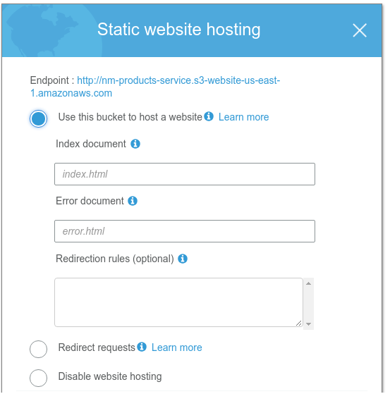
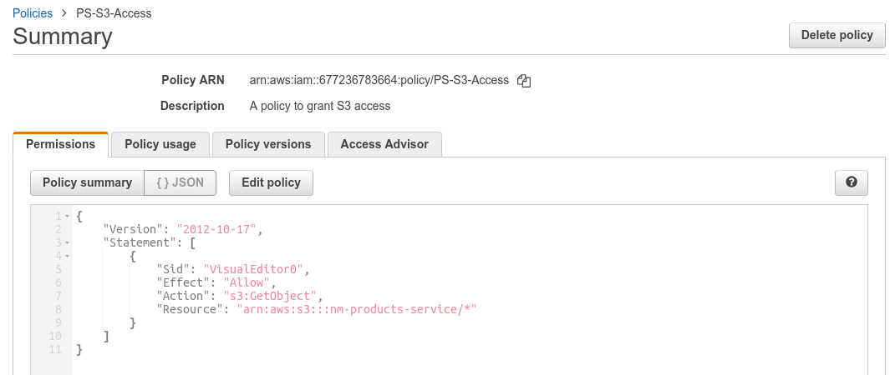
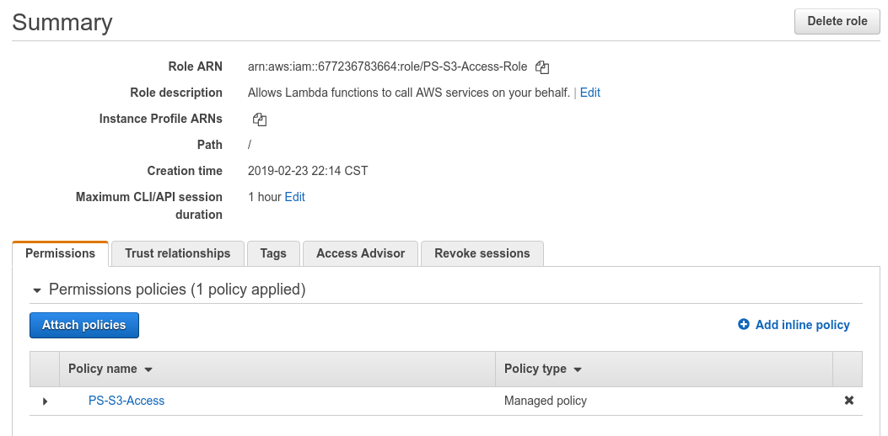

# ProductsService - 
### The tuorial below helps to create a Producton ready serverless application AWS S3, API Gateway, Lambda Functions, CloudFront, CloudWatch, Canary,  Step Functions and DynamoDB.
### [Live Serverless ProductsService Project Link](http://nm-products-service.s3-website-us-east-1.amazonaws.com/)
### Features:
- This application is a full fledged, production ready serverless application.
- Incognito is used for user authentication
- DynamoDB is used to store products data 
- API Gateway and Lambda Functions to expose versioned, production ready APIs with canary feature to facilitiate staged deployment
- CloudFront as a CDN 
- Cloudwatch for logging 

### Lets tabulate the steps as below:
Steps | Actions
------------ | -------------
Step 01  | Create a S3 bucket and configure it as a static website
Step 02  | Setup Policies and Roles for Lambda to access S3
Step 03  | Create DynamoDB to store ProductsTable
Step 04  | Create Lambda Functions and API Gateway to expose functionalities to creat, edit, update, delete products
Step 05  | Setup Cognito for creating users
Step 06  | Steps to make ProductsService Production ready

#### Step 01  | Create a S3 bucket and configure it as a static website
 - create a bucket - 'nm-products-service'.
 - Use the following policy statement to make the bucket public:
   ```
   {
     "Version": "2012-10-17",
     "Id": "Policy20190223214051",
     "Statement": [
        {
            "Sid": "Stmt20190223214051",
            "Effect": "Allow",
            "Principal": "*",
            "Action": "s3:GetObject",
            "Resource": "arn:aws:s3:::nm-products-service/*"
        }
     ]
   } 
   ```
 - Please see the screenshot below for reference:
 
 - Also, configure it as a static website.
 
 = So now our static site will be ( dont worry, we will soon upload the files to the website) - http://nm-products-service.s3-website-us-east-1.amazonaws.com
 
#### Step 02  | Setup Policies and Roles for Lambda to access S3
 - create a policy named 'PS-S3-Access-Policy' for access to S3.
 - Please see the screenshot below for reference:
 
 - Now create a policy named 'PS-S3-Access-Role' for Lambda to access S3.
 - Attach policy 'PS-S3-Access-Policy' to the role.
 - Please see the screenshot below for reference:
 
 
 
### More to follow(penning it up).