# ProductsService - Part 02  | [Setting up Lambda Functions and API Gateway]
### Lets tabulate the steps as below:
Steps | Actions
------------ | -------------
Step 01  | Setup Lambda functions
Step 02  | Setup API Gateway
Step 03  | Advanced Configuration for Lambda functions and API gateway

#### Step 01  | Setup Lambda functions
 - create 4 lambda functions - PS-Categories-GET, PS-SubCategories-GET, PS-Promotions-GET, PS-Products-GET respectively to retrieve data from each table
 - We will use the DynamoDB 'scan' function to scan all rows from these tables.

 - Use the following script PS-Categories-GET Lambda functions:
   ```
    import boto3
    import decimal
    import json
    from boto3.dynamodb.conditions import Key, Attr

    dynamodb = boto3.resource('dynamodb', region_name='us-east-1')
    table = dynamodb.Table('PS-Categories')

    # Helper class to convert a DynamoDB item to JSON.
    class DecimalEncoder(json.JSONEncoder):
        def default(self, o):
            if isinstance(o, decimal.Decimal):
                if o % 1 > 0:
                    return float(o)
                else:
                    return int(o)
            return super(DecimalEncoder, self).default(o)

    def handler(event, context):
        # PS-Categorie - Partion Key: CategoryID, Attributes: CategoryName, IsActive
        filterExpression = Attr('IsActive').between(0, 1)
        projectionExpression = "CategoryID, CategoryName, IsActive"
        # Expression Attribute Names for Projection Expression only.
        # expressionAttributeNames = { "#yr": "year", }

        response = table.scan(
            FilterExpression=filterExpression,
            ProjectionExpression=projectionExpression #,
            #ExpressionAttributeNames=ean
        )

        for i in response['Items']:
            print(json.dumps(i, cls=DecimalEncoder))

   ```
   - 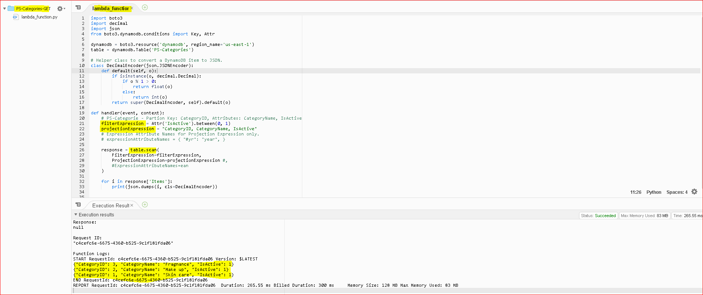
   
- Also create a Test Scipt to test the scan function(See file PSCategoriesGETTest.txt)
    - Since the Lambda function does not take any parameters, please use {} (blank JSON, for the input parameters for the test)
    - 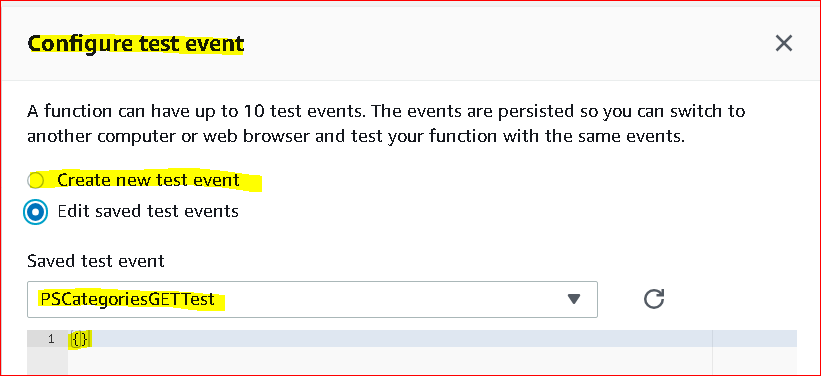
    
    
- Use the following script PS-SubCategories-GET Lambda functions:
   ```
    import boto3
    import decimal
    import json
    from boto3.dynamodb.conditions import Key, Attr

    dynamodb = boto3.resource('dynamodb', region_name='us-east-1')
    table = dynamodb.Table('PS-SubCategories')

    # Helper class to convert a DynamoDB item to JSON.
    class DecimalEncoder(json.JSONEncoder):
        def default(self, o):
            if isinstance(o, decimal.Decimal):
                if o % 1 > 0:
                    return float(o)
                else:
                    return int(o)
            return super(DecimalEncoder, self).default(o)

    def handler(event, context):
        # PS-SubCategories - Partion Key: SubCategoryID, Attributes: SubCategoryName, CategoryID, IsActive
        filterExpression = Attr('IsActive').between(0, 1)
        projectionExpression = "SubCategoryID, SubCategoryName, CategoryID, IsActive"
        # Expression Attribute Names for Projection Expression only.
        # expressionAttributeNames = { "#yr": "year", }

        response = table.scan(
            FilterExpression=filterExpression,
            ProjectionExpression=projectionExpression #,
            #ExpressionAttributeNames=ean
        )

        for i in response['Items']:
            print(json.dumps(i, cls=DecimalEncoder))

   ```
   - 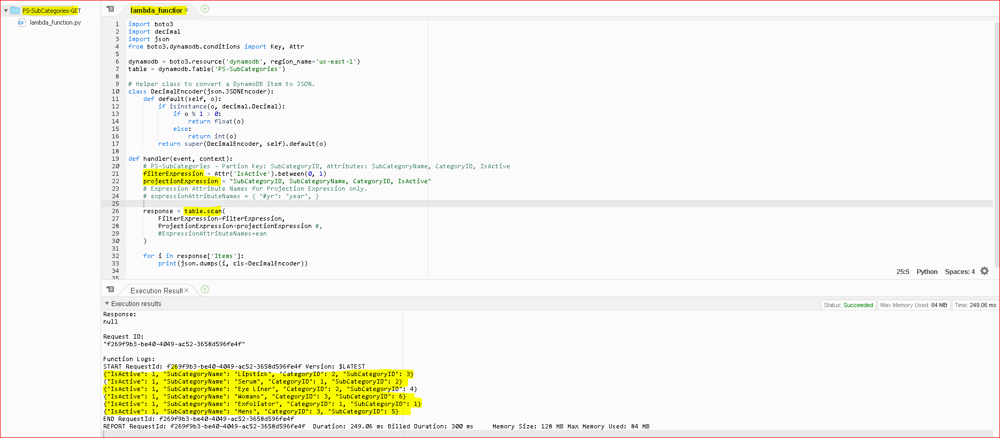
   
- Also create a Test Scipt to test the scan function(See file PSSubCategoriesGETTest.txt)
    - Since the Lambda function does not take any parameters, please use {} (blank JSON, for the input parameters for the test)
    - 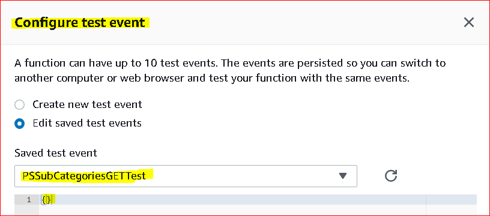
    
    
- Use the following script PS-Promotions-GET Lambda functions:
   ```
    import boto3
    import decimal
    import json
    from boto3.dynamodb.conditions import Key, Attr

    dynamodb = boto3.resource('dynamodb', region_name='us-east-1')
    table = dynamodb.Table('PS-Promotions')

    # Helper class to convert a DynamoDB item to JSON.
    class DecimalEncoder(json.JSONEncoder):
        def default(self, o):
            if isinstance(o, decimal.Decimal):
                if o % 1 > 0:
                    return float(o)
                else:
                    return int(o)
            return super(DecimalEncoder, self).default(o)

    def handler(event, context):
        # PS-Promotions table - Partion Key: PromotionID, Attributes: PromotionName, IsActive, PromotionDiscount
        filterExpression = Attr('IsActive').between(0, 1)
        projectionExpression = "PromotionID, PromotionName, IsActive"
        # Expression Attribute Names for Projection Expression only.
        # expressionAttributeNames = { "#yr": "year", }

        response = table.scan(
            FilterExpression=filterExpression,
            ProjectionExpression=projectionExpression #,
            #ExpressionAttributeNames=ean
        )

        for i in response['Items']:
            print(json.dumps(i, cls=DecimalEncoder))


   ```
   - 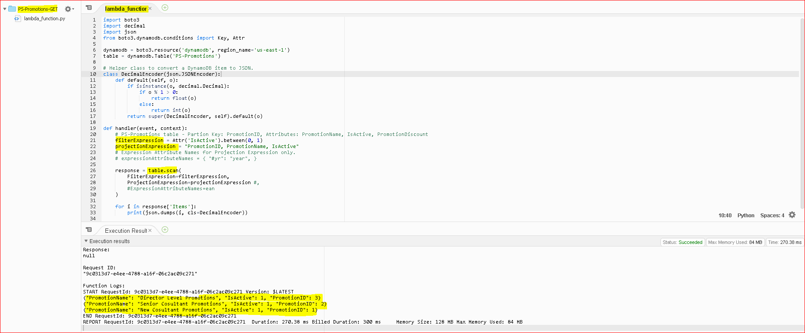
   
- Also create a Test Scipt to test the scan function(See file PSPromotionsGETTest.txt)
    - Since the Lambda function does not take any parameters, please use {} (blank JSON, for the input parameters for the test)
    - 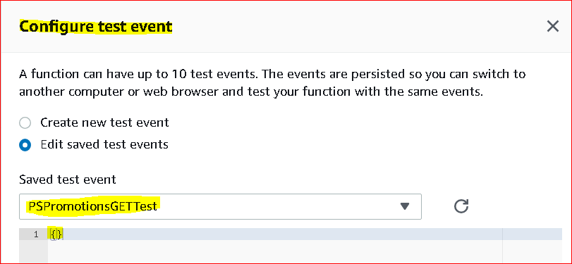

- Use the following script PS-Products-GET Lambda functions:
   ```
    import boto3
    import decimal
    import json
    from boto3.dynamodb.conditions import Key, Attr

    dynamodb = boto3.resource('dynamodb', region_name='us-east-1')
    table = dynamodb.Table('PS-Products')

    # Helper class to convert a DynamoDB item to JSON.
    class DecimalEncoder(json.JSONEncoder):
        def default(self, o):
            if isinstance(o, decimal.Decimal):
                if o % 1 > 0:
                    return float(o)
                else:
                    return int(o)
            return super(DecimalEncoder, self).default(o)

    def handler(event, context):
        # PS-Products table - Partion Key: ProductID, Attributes: ProductName, ProductDescription, Price, CategoryID, SubCategoryID, PromotionID, IsActive
        filterExpression = Attr('IsActive').between(0, 1)
        projectionExpression = "ProductID, ProductName, ProductDescription, Price, CategoryID, SubCategoryID, PromotionID, IsActive"
        # Expression Attribute Names for Projection Expression only.
        # expressionAttributeNames = { "#yr": "year", }

        response = table.scan(
            FilterExpression=filterExpression,
            ProjectionExpression=projectionExpression #,
            #ExpressionAttributeNames=ean
        )

        for i in response['Items']:
            print(json.dumps(i, cls=DecimalEncoder))


   ```
   - 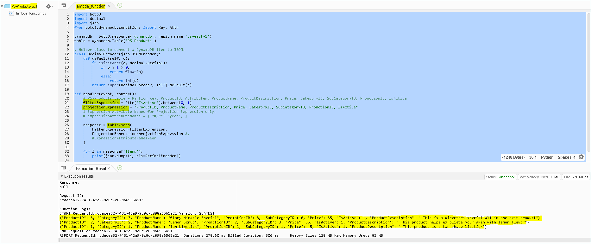
   
- Also create a Test Scipt to test the scan function(See file PSProductsGETTest.txt)
    - Since the Lambda function does not take any parameters, please use {} (blank JSON, for the input parameters for the test)
    - 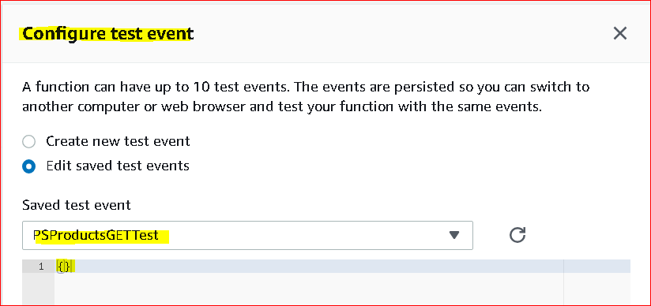

#### Step 02  | Setup API Gateway
 - Create a new API Gateway - ***ProductServiceAPI***.
   - 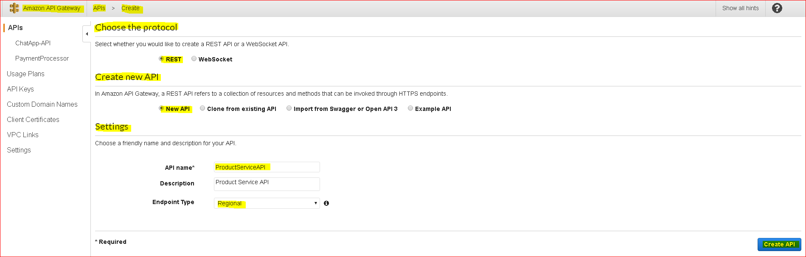
   
 - Now create 4 ***resources*** under the ProductServiceAPI named categories, subcategories, promotions, products
   - 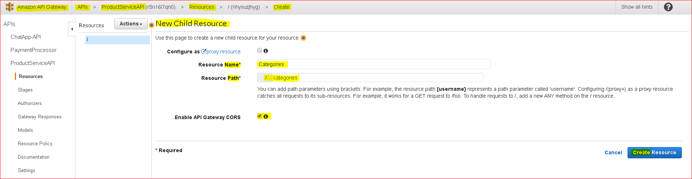
   - 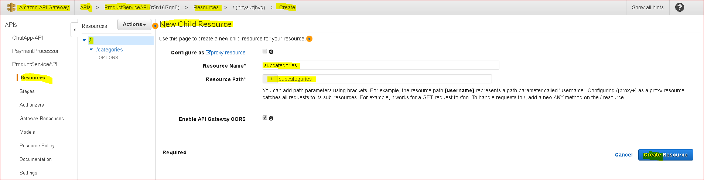
   - 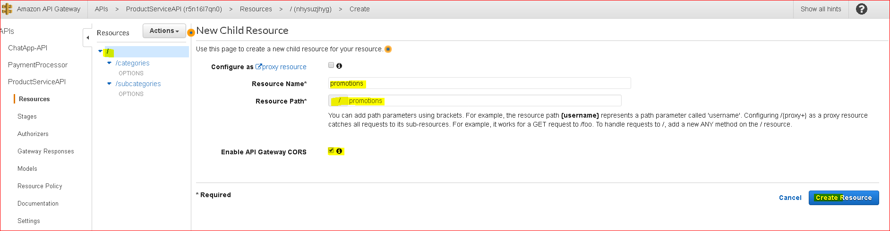
   - 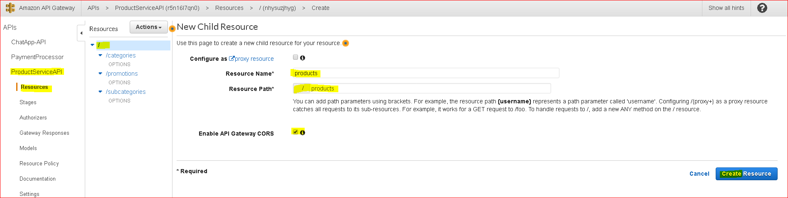
   
- Now create ***methods*** GET,  for the resources for the ProductServiceAPI
   - 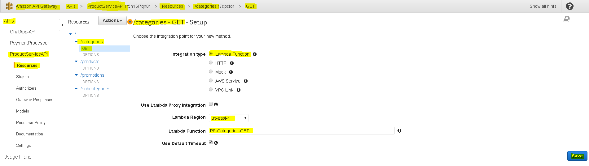 
   - 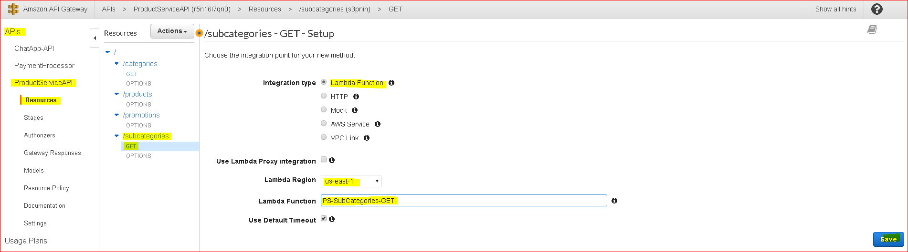 
   - 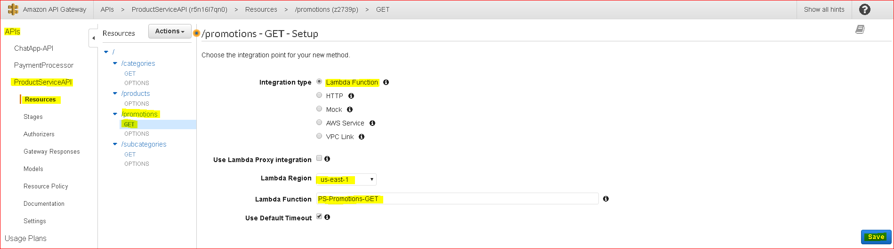 
   - 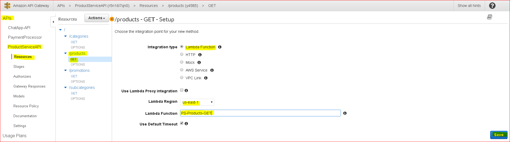 
   
   ```
   ```
### More to follow(penning it up).