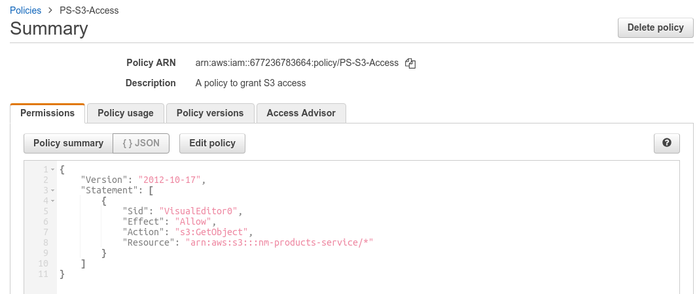
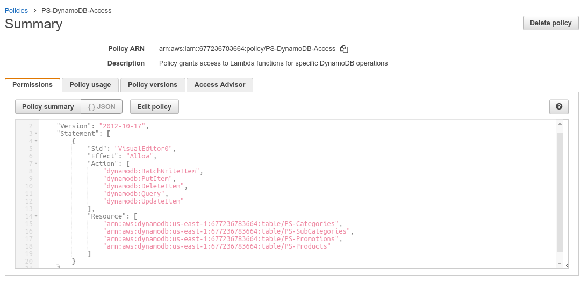
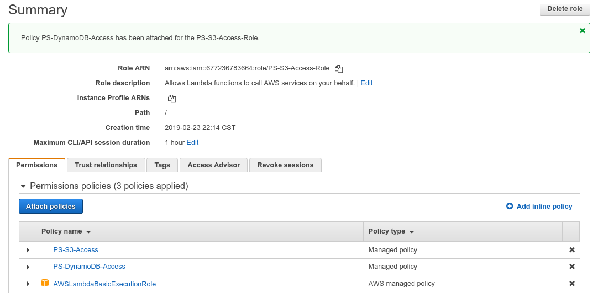
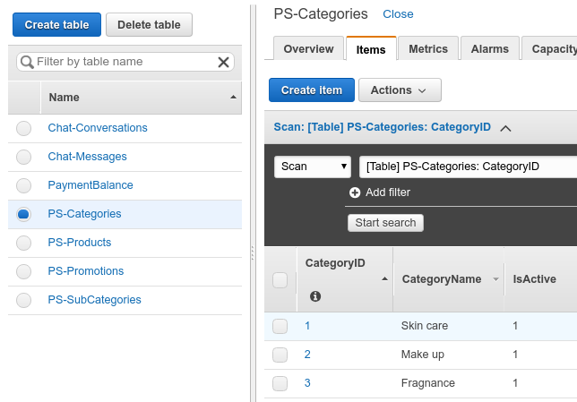
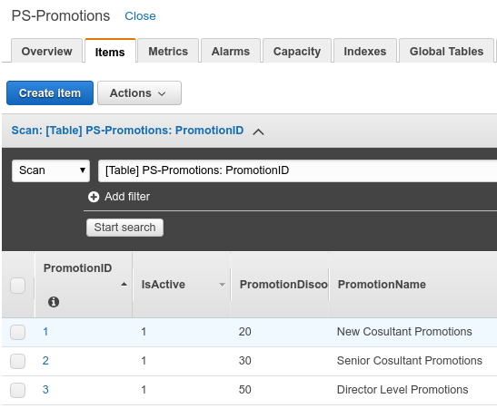
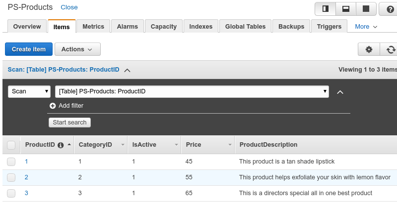
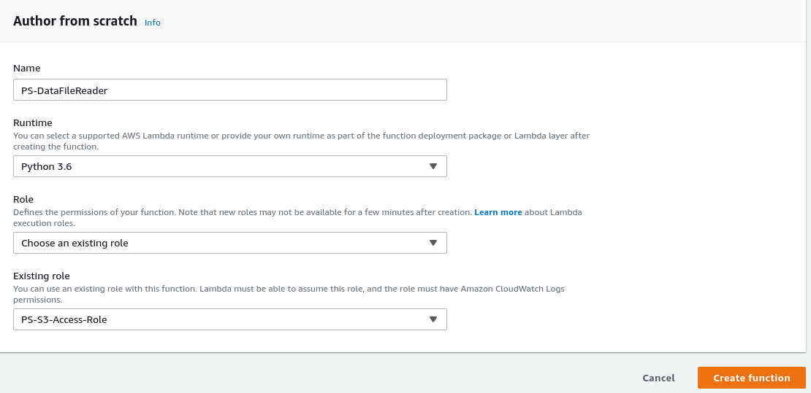
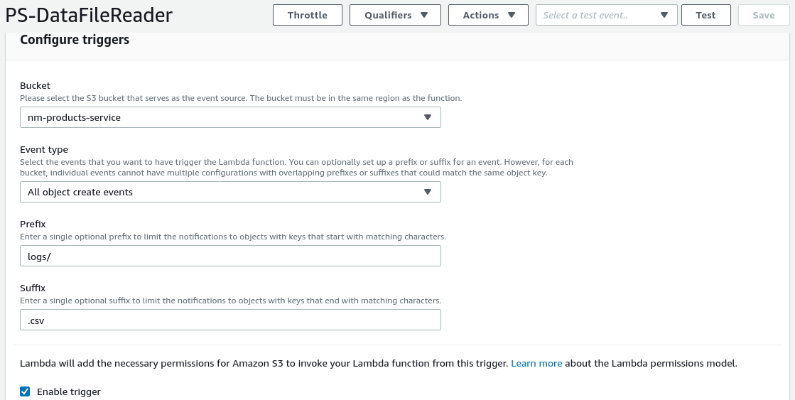
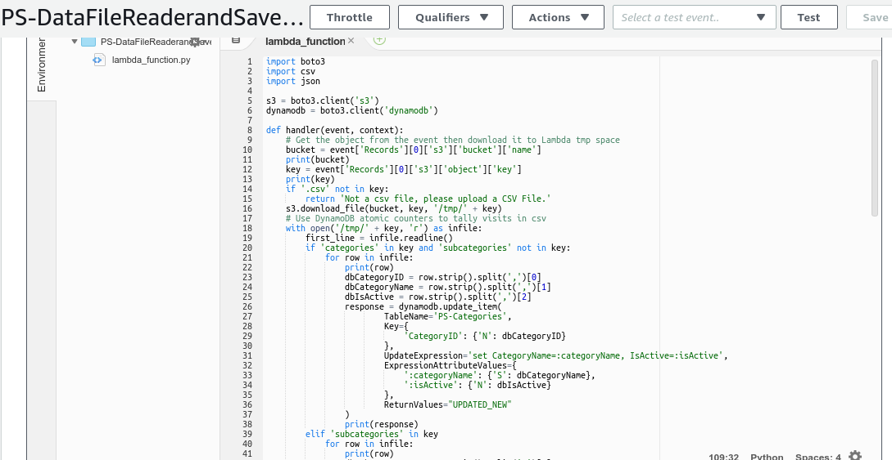

# ProductsService - Part 01  | [Setting up roles, policies, S3 and DynamoDB tables]
### Lets tabulate the steps as below:
Steps | Actions
------------ | -------------
Step 01  | Create a S3 bucket and configure it as a static website
Step 02  | Setup Policies and Roles for Lambda to access S3
Step 03  | Create DynamoDB to store Products data

#### Step 01  | Create a S3 bucket and configure it as a static website
 - create a bucket - 'nm-products-service'.
 - Use the following policy statement to make the bucket public:
   ```
   {
     "Version": "2012-10-17",
     "Id": "Policy20190223214051",
     "Statement": [
        {
            "Sid": "Stmt20190223214051",
            "Effect": "Allow",
            "Principal": "*",
            "Action": "s3:GetObject",
            "Resource": "arn:aws:s3:::nm-products-service/*"
        }
     ]
   } 
   ```
 - Please see the screenshot below for reference:
 
 - Also, configure it as a static website.
 
 - So now our static site will be ( dont worry, we will soon upload the files to the website) - http://nm-products-service.s3-website-us-east-1.amazonaws.com
 
#### Step 02  | Setup Policies and Roles for Lambda to access S3 and DynamoDB
 - create a policy named 'PS-S3-Access' for access to S3.
 - Use following JSON( or refer to the link here -  ):
 ```
 {
    "Version": "2012-10-17",
    "Statement": [
        {
            "Sid": "VisualEditor0",
            "Effect": "Allow",
            "Action": "s3:GetObject",
            "Resource": "arn:aws:s3:::nm-products-service/*"
        }
    ]
 }
 ```
 - create a policy named 'PS-DynamoDB-Access' for access to DynamoDB.
 - Use following JSON( or refer to the link here -  ):
 ```
 {
    "Version": "2012-10-17",
    "Statement": [
        {
            "Sid": "VisualEditor0",
            "Effect": "Allow",
            "Action": [
                "dynamodb:BatchWriteItem",
                "dynamodb:PutItem",
                "dynamodb:Query"
            ],
            "Resource": [
                "arn:aws:dynamodb:us-east-1:677236783664:table/PS-Categories",
                "arn:aws:dynamodb:us-east-1:677236783664:table/PS-SubCategories",
                "arn:aws:dynamodb:us-east-1:677236783664:table/PS-Promotions",
                "arn:aws:dynamodb:us-east-1:677236783664:table/PS-Products"
            ]
        }
    ]
  }
  ```
 - Please see the screenshot below for reference:
 
 
 - Now create a policy named 'PS-S3-DynamoDB-Access-Role' for Lambda to access S3 and DynamoDB.
 - Attach policy 'PS-S3-Access' to the role.
 - Also, attach policy 'PS-DynamoDB-Access' to the role.
 - Also, attach policy 'AWSLambdaBasicExecutionRole' to the role.    
 - Please see the screenshot below for reference:
 
 
#### Step 03  | Create DynamoDB to store Products data
 - We will use a a down-graded version of a Product service
    - Products table - stores products info
    - Categories table - stores categories of the products
    - SubCategories table - stores sub-categories of the products 
    - Promotions table - stores promotions for providing discounts on the product
    - We will use a small script to upload the table with some sample data and then we can always add/delete/update them.
    - Lets start creating tables:
        - Categories table - Partion Key: CategoryID, Attributes: CategoryName, IsActive
        - SubCategories table - Partion Key: SubCategoryID, Attributes: SubCategoryName, CategoryID, IsActive 
        - Promotions table - Partion Key: PromotionID, Attributes: PromotionName, IsActive, PromotionDiscount
        - Products table -  Partion Key: ProductID, Attributes: ProductName, ProductDescription, Price, CategoryID, SubCategoryID,
                            PromotionID, IsActive
    - Please see the screenshot below for reference:
    
    
    
    
    
    - Please use the script below to create sample categories, subcategories , promotions and products.
    - Create a file DataFileGenerator.py and save the script below and execute the file to generate the data files)
    ```
    import names
    import random
    import os

    dirName = 'logs';
    if not os.path.exists(dirName):
        os.mkdir(dirName)

    # categories csv file
    filePath = dirName + '/categories.csv';
    with open(filePath, 'w+') as outfile:
        outfile.write('CategoryID,CategoryName,IsActive\n')
        outfile.write('1,Skin care,1\n')
        outfile.write('2,Make up,1\n')
        outfile.write('3,Fragnance,1\n')
        outfile.close()
        print('Please check the file at path:' + os.path.abspath(filePath));

    # sub categories csv file
    filePath = dirName + '/subcategories.csv';
    with open(filePath, 'w+') as outfile:
        outfile.write('SubCategoryID,SubCategoryName,CategoryID,IsActive\n')
        outfile.write('1,Exfoliator,1,1\n')
        outfile.write('2,Serum,1,1\n')
        outfile.write('3,Lipstick,2,1\n')
        outfile.write('4,Eye Liner,2,1\n')
        outfile.write('5,Mens,3,1\n')
        outfile.write('6,Womans,3,1\n')
        outfile.close()
        print('Please check the file at path:' + os.path.abspath(filePath));  

    # promotions csv file
    filePath = dirName + '/promotions.csv';
    with open(filePath, 'w+') as outfile:
        outfile.write('PromotionID,PromotionName,PromotionDiscount,IsActive\n')
        outfile.write('1,New Cosultant Promotions,20,1\n')
        outfile.write('2,Senior Cosultant Promotions,30,1\n')
        outfile.write('3,Director Level Promotions,50,1\n')
        outfile.close()
        print('Please check the file at path:' + os.path.abspath(filePath));

    # products csv file
    filePath = dirName + '/products.csv';
    with open(filePath, 'w+') as outfile:
        outfile.write('ProductID,ProductName, ProductDescription, Price, CategoryID, SubCategoryID,PromotionID, IsActive\n')
        outfile.write('1,Tan Lipstick, This product is a tan shade lipstick,45,1,1,1,1\n')
        outfile.write('2,Lemon Scrub, This product helps exfoliate your skin with lemon flavor,55,2,3,2,1\n')
        outfile.write('3,Glory Miracle Special, This is a directors special all in one best product,65,3,6,3,1\n')
        outfile.close()
        print('Please check the file at path:' + os.path.abspath(filePath));
    ```
    - Now create a lambda function with a trigger to read the categories, subcategories , promotions and products files and save it into DynamoDB as test data
    ```
    import boto3
    import csv 
    import json

    s3 = boto3.client('s3')
    dynamodb = boto3.client('dynamodb')

    def handler(event, context):
        # Get the object from the event then download it to Lambda tmp space
        bucket = event['Records'][0]['s3']['bucket']['name']
        print(bucket)
        key = event['Records'][0]['s3']['object']['key']
        print(key)
        if '.csv' not in key:
            return 'Not a csv file, please upload a CSV File.'
        s3.download_file(bucket, key, '/tmp/' + key[5:])
        # Use DynamoDB atomic counters to tally visits in csv
        with open('/tmp/' + key[5:], 'r') as infile:
            first_line = infile.readline()
            if 'subcategories' in key[5:]:
                for row in infile:
                    print('Inside: ' + key[5:])
                    print(row)
                    dbSubCategoryID= row.strip().split(',')[0]
                    dbSubCategoryName = row.strip().split(',')[1]
                    dbCategoryID = row.strip().split(',')[2]
                    dbIsActive = row.strip().split(',')[3]
                    #E.g. 1,Exfoliator,1,1
                    response = dynamodb.update_item(
                            TableName='PS-SubCategories', 
                            Key={
                                'SubCategoryID': {'N': dbSubCategoryID},
                                'CategoryID': {'N': dbCategoryID}
                            },
                            UpdateExpression='set SubCategoryName=:subCategoryName, IsActive=:isActive',
                            ExpressionAttributeValues={
                                ':subCategoryName': {'S': dbSubCategoryName},
                                ':isActive': {'N': dbIsActive}
                            },
                            ReturnValues="UPDATED_NEW"
                    )
                    print(response)
            elif 'categories' in key[5:]:
                for row in infile:
                    print('Inside: ' + key[5:])
                    print(row)
                    dbCategoryID = row.strip().split(',')[0]
                    dbCategoryName = row.strip().split(',')[1]
                    dbIsActive = row.strip().split(',')[2]
                    #E.g. 1,Skin care,1
                    response = dynamodb.update_item(
                            TableName='PS-Categories', 
                            Key={
                                'CategoryID': {'N': dbCategoryID}
                            },
                            UpdateExpression='set CategoryName=:categoryName, IsActive=:isActive',
                            ExpressionAttributeValues={
                                ':categoryName': {'S': dbCategoryName},
                                ':isActive': {'N': dbIsActive}
                            },
                            ReturnValues="UPDATED_NEW"
                    )
                    print(response)
            elif 'promotions' in key[5:]:
                for row in infile:
                    print('Inside: ' + key[5:])
                    print(row)
                    dbPromotionID= row.strip().split(',')[0]
                    dbPromotionName = row.strip().split(',')[1]
                    dbPromotionDiscount = row.strip().split(',')[2]
                    dbIsActive = row.strip().split(',')[3]
                    #E.g. 1,New Cosultant Promotions,20,1
                    response = dynamodb.update_item(
                            TableName='PS-Promotions', 
                            Key={
                                'PromotionID': {'N': dbPromotionID}
                            },
                            UpdateExpression='set PromotionName=:promotionName, PromotionDiscount=:promotionDiscount, IsActive=:isActive',
                            ExpressionAttributeValues={
                                ':promotionName': {'S': dbPromotionName},
                                ':promotionDiscount': {'N': dbPromotionDiscount},
                                ':isActive': {'N': dbIsActive}
                            },
                            ReturnValues="UPDATED_NEW"
                    )
                    print(response)
            elif 'products' in key[5:]:
                for row in infile:
                    print('Inside: ' + key[5:])
                    print(row)
                    dbProductID= row.strip().split(',')[0]
                    dbProductName = row.strip().split(',')[1]
                    dbProductDescription = row.strip().split(',')[2]
                    dbPrice = row.strip().split(',')[3]
                    dbCategoryID = row.strip().split(',')[4]
                    dbSubCategoryID = row.strip().split(',')[5]
                    dbPromotionID = row.strip().split(',')[6]
                    dbIsActive = row.strip().split(',')[7]
                    # E.g. 1,Tan Lipstick, This product is a tan shade lipstick, 45, 1, 1, 1, 1
                    response = dynamodb.update_item(
                            TableName='PS-Products', 
                            Key={
                                'ProductID': {'N': dbProductID}
                            },
                            UpdateExpression='set ProductName=:productName, ProductDescription=:productDescription, Price=:price, CategoryID=:categoryID, SubCategoryID=:subCategoryID, PromotionID=:promotionID, IsActive=:isActive',
                            ExpressionAttributeValues={
                                ':productName': {'S': dbProductName},
                                ':productDescription': {'S': dbProductDescription},
                                ':price': {'N': dbPrice},
                                ':categoryID': {'N': dbCategoryID},
                                ':subCategoryID': {'N': dbSubCategoryID},
                                ':promotionID': {'N': dbPromotionID},
                                ':isActive': {'N': dbIsActive}
                            },
                            ReturnValues="UPDATED_NEW"
                    )
                    print(response)
    ```
    - Please see the screenshot below for reference for the trigger and the lambda code:
    
    
    
    
### More to follow(penning it up).